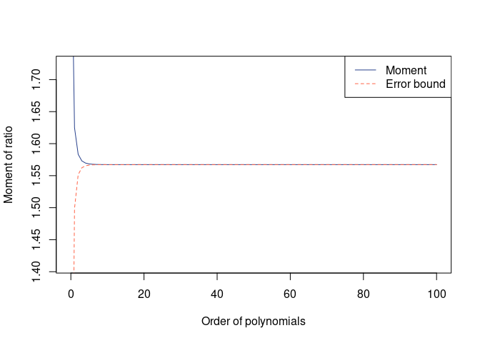
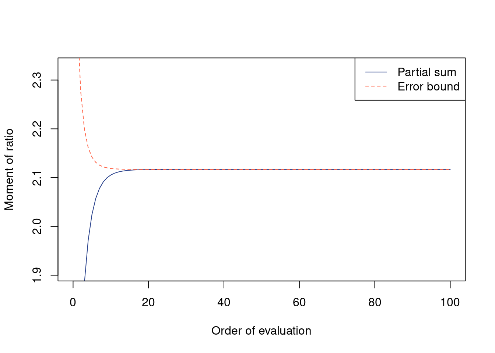
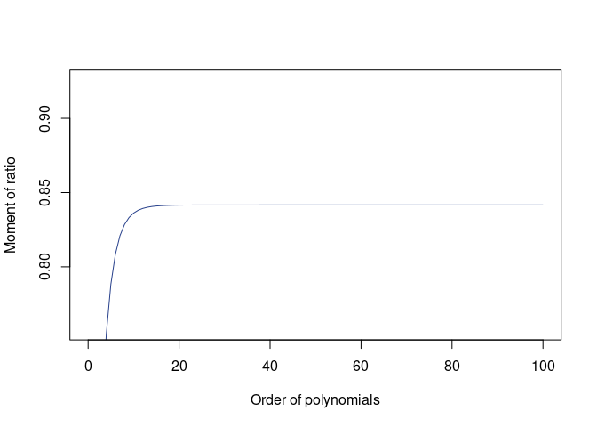
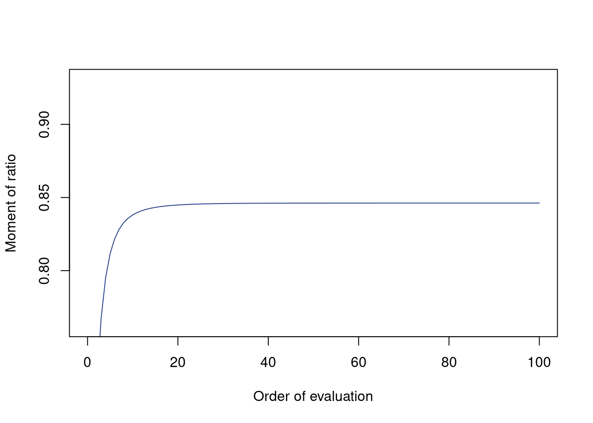
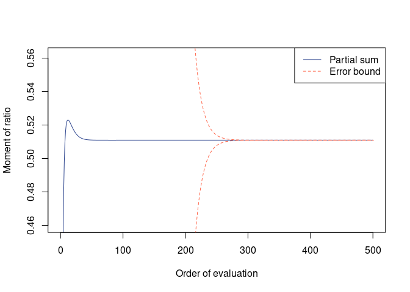

<!-- README.md is generated from README.Rmd. Please edit that file -->

# qfratio: R Package for Moments of Ratios of Quadratic Forms

<!-- badges: start -->
<!-- badges: end -->

This package provides functions to evaluate moments of ratios (and
products) of quadratic forms in normal variables, specifically using
recursive algorithms developed by Hillier, Bao, Kan and colleagues.
Generating functions for these moments are closely related to the
top-order zonal and invariant polynomials of matrix arguments.

There exist a couple of `Matlab` programs developed by Raymond Kan
(available from <https://www-2.rotman.utoronto.ca/~kan/>), but this `R`
package is an independent project (not a fork or translation) and has
different functionalities, including evaluation of moments of multiple
ratios of a particular form and scaling to avoid numerical overflow.
This has originally been developed for a biological application,
specifically for evaluating average evolvability measures in
evolutionary quantitative genetics ([Watanabe,
2022](#ref-Watanabe2022cevo)).

This project is in a late stage of development. Most functionalities
have been implemented and are considered stable. Documentations of the
package and functions are partly under construction. Feedbacks are much
appreciated.

## Installation

***WARNING*** Installation size of this package can be very large (~130
MB on Linux; ~3 MB on Windows with `Rtools42`), as it involves lots of
`RcppEigen` functions.

``` r
## Install devtools first:
# install.packages("devtools")

## Recommended installation (pandoc required):
devtools::install_github("watanabe-j/qfratio", dependencies = TRUE, build_vignettes = TRUE)

## Minimal installation:
# devtools::install_github("watanabe-j/qfratio")
```

This package has the following dependencies:

    Imports: Rcpp, MASS
    LinkingTo: Rcpp, RcppEigen
    Suggests: gsl, mvtnorm, graphics, stats, testthat (>= 3.0.0), rlang (>= 0.4.7),
              knitr, rmarkdown

You also need [`pandoc`](https://pandoc.org) for correctly building the
vignette. (For `pandoc < 2.11`, `pandoc-citeproc` is required as well.)

## Examples

Here are some simple examples:

``` r
## Simple matrices
nv <- 4
A <- diag(1:nv)
B <- diag(sqrt(nv:1))

## Expectation of (x^T A x)^2 / (x^T x)^2 where x ~ N(0, I)
qfrm(A, p = 2)
#> 
#>  Moment of ratio of quadratic forms
#> 
#> Moment = 6.666667
#> This value is exact

## Compare with Monte Carlo mean
mean(rqfr(1000, A = A, p = 2))
#> [1] 6.641507

## Expectation of (x^T A x)^1/2 / (x^T x)^1/2
(mom_A0.5 <- qfrm(A, p = 1/2))
#> 
#>  Moment of ratio of quadratic forms
#> 
#> Moment = 1.567224, Error = -6.335806e-19 (one-sided)
#> Possible range:
#>  1.56722381 1.56722381

## Monte Carlo mean
mean(rqfr(1000, A = A, p = 1/2))
#> [1] 1.569643

plot(mom_A0.5)
```



``` r

## Expectation of (x^T x) / (x^T A^-1 x)
##   = "average conditional evolvability"
(avr_cevoA <- qfrm(diag(nv), solve(A)))
#> 
#>  Moment of ratio of quadratic forms
#> 
#> Moment = 2.11678, Error = 2.768619e-15 (one-sided)
#> Possible range:
#>  2.11677962 2.11677962

mean(rqfr(1000, A = diag(nv), B = solve(A), p = 1))
#> [1] 2.071851
plot(avr_cevoA)
```



``` r

## Expectation of (x^T x)^2 / (x^T A x) (x^T A^-1 x)
##   = "average autonomy"
(avr_autoA <- qfmrm(diag(nv), A, solve(A), p = 2, q = 1, r = 1))
#> 
#>  Moment of ratio of quadratic forms
#> 
#> Moment = 0.8416553
#> Error bound unavailable; recommended to inspect plot() of this object

mean(rqfmr(1000, A = diag(nv), B = A, D = solve(A), p = 2, q = 1, r = 1))
#> [1] 0.8377911
plot(avr_autoA)
```



``` r

## Expectation of (x^T A B x) / ((x^T A^2 x) (x^T B^2 x))^1/2
##   = "average response correlation"
## whose Monte Carlo evaluation is called the "random skewers" analysis,
## while this is essentially an analytic solution (with slight truncation error)
(avr_rcorA <- qfmrm(crossprod(A, B), crossprod(A), crossprod(B),
                    p = 1, q = 1/2, r = 1/2))
#> 
#>  Moment of ratio of quadratic forms
#> 
#> Moment = 0.8462192
#> Error bound unavailable; recommended to inspect plot() of this object

mean(rqfmr(1000, A = crossprod(A, B), B = crossprod(A), D = crossprod(B),
           p = 1, q = 1/2, r = 1/2))
#> [1] 0.8467811
plot(avr_rcorA)
```



``` r


## More complex (but arbitrary) example
## Expectation of (x^T A x)^2 / (x^T B x)^3 where x ~ N(mu, Sigma)
mu <- 1:nv / nv
Sigma <- diag(runif(nv) * 3)
(mom_A2B3 <- qfrm(A, B, p = 2, q = 3, mu = mu, Sigma = Sigma,
                  m = 500, use_cpp = TRUE))
#> 
#>  Moment of ratio of quadratic forms
#> 
#> Moment = 0.510947, Error = 0 (two-sided)
#> Possible range:
#>  0.510946975 0.510946975
plot(mom_A2B3)
```



## References

<div id="refs" class="references csl-bib-body hanging-indent"
line-spacing="2">

<div id="ref-BaoKan2013" class="csl-entry">

Bao, Y., & Kan, R. (2013). On the moments of ratios of quadratic forms
in normal random variables. *Journal of Multivariate Analysis*, *117*,
229–245. <https://doi.org/10.1016/j.jmva.2013.03.002>

</div>

<div id="ref-HillierEtAl2009" class="csl-entry">

Hillier, G., Kan, R., & Wang, X. (2009). Computationally efficient
recursions for top-order invariant polynomials with applications.
*Econometric Theory*, *25*, 211–242.
<https://doi.org/10.1017/S0266466608090075>

</div>

<div id="ref-HillierEtAl2014" class="csl-entry">

Hillier, G., Kan, R., & Wang, X. (2014). Generating functions and short
recursions, with applications to the moments of quadratic forms in
noncentral normal vectors. *Econometric Theory*, *30*, 436–473.
<https://doi.org/10.1017/S0266466613000364>

</div>

<div id="ref-Smith1989" class="csl-entry">

Smith, M. D. (1989). On the expectation of a ratio of quadratic forms in
normal variables. *Journal of Multivariate Analysis*, *31*, 244–257.
<https://doi.org/10.1016/0047-259X(89)90065-1>

</div>

<div id="ref-Smith1993" class="csl-entry">

Smith, M. D. (1993). Expectations of ratios of quadratic forms in normal
variables: Evaluating some top-order invariant polynomials. *Australian
Journal of Statistics*, *35*, 271–282.
<https://doi.org/10.1111/j.1467-842X.1993.tb01335.x>

</div>

<div id="ref-Watanabe2022cevo" class="csl-entry">

Watanabe, J. (2022). Exact expressions and numerical evaluation of
average evolvability measures for characterizing and comparing **G**
matrices. *bioRxiv*, 2022.11.02.514929.
<https://doi.org/10.1101/2022.11.02.514929>

</div>

</div>
