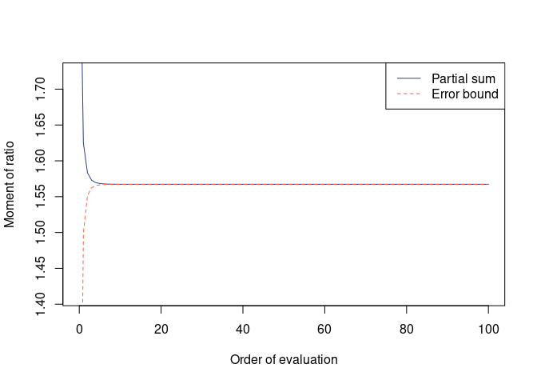
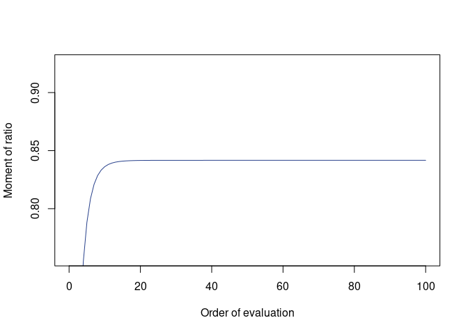
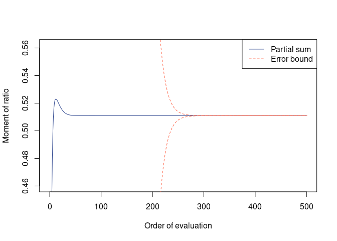
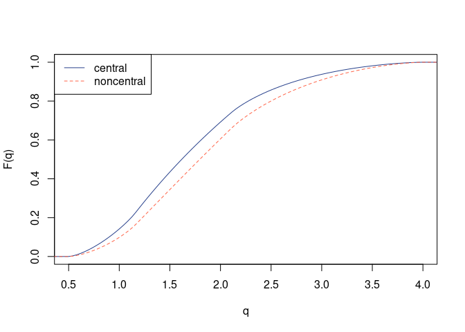
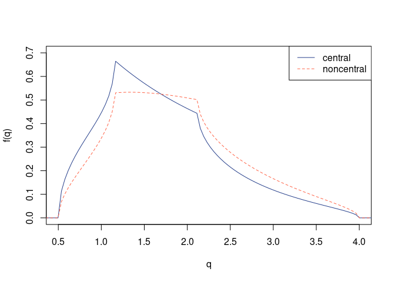

<!-- README.md is generated from README.Rmd. Please edit that file -->

# qfratio: R Package for Moments and Distributions of Ratios of Quadratic Forms

<!-- badges: start -->

[](https://github.com/watanabe-j/qfratio/actions/workflows/R-CMD-check.yaml)
<!-- badges: end -->

This package provides functions to evaluate moments of ratios (and
products) of quadratic forms in normal variables, specifically using
recursive algorithms developed by Bao and Kan ([2013](#ref-BaoKan2013))
and Hillier et al. ([2014](#ref-HillierEtAl2014)). Generating functions
for these moments are closely related to the top-order zonal and
invariant polynomials of matrix arguments. It also provides some
functions to evaluate distribution and density functions of simple
ratios of quadratic forms in normal variables using several methods from
Imhof ([1961](#ref-Imhof1961)), Hillier ([2001](#ref-Hillier2001)),
Forchini ([2002](#ref-Forchini2002), [2005](#ref-Forchini2005)), Butler
and Paolella ([2008](#ref-ButlerPaolella2008)), and Broda and Paolella
([2009](#ref-BrodaPaolella2009)).

There exist a couple of `Matlab` programs developed by Raymond Kan
(available from <https://www-2.rotman.utoronto.ca/~kan/>) for evaluating
the moments, but this `R` package is an independent project (not a fork
or translation) and has different functionalities, including evaluation
of moments of multiple ratios of a particular form and scaling to avoid
numerical overflow. This has originally been developed for a biological
application, specifically for evaluating average evolvability measures
in evolutionary quantitative genetics ([Watanabe,
2023](#ref-Watanabe2023cevo)), but can be used for a broader class of
statistics.

## Installation

***WARNING*** Installation size of this package can be very large (\>100
MB on Linux and macOS; ~3 MB on Windows with a recent version (`>= 4.2`)
of `Rtools`), as it involves lots of `RcppEigen` functions.

### From CRAN (stable version)

``` r
install.packages("qfratio")
```

### From GitHub (development version)

``` r
## Install devtools first:
# install.packages("devtools")

## Recommended installation (pandoc required):
devtools::install_github("watanabe-j/qfratio", dependencies = TRUE, build_vignettes = TRUE)

## Minimal installation:
# devtools::install_github("watanabe-j/qfratio")
```

### Dependencies

    Imports: Rcpp, MASS, CompQuadForm
    LinkingTo: Rcpp, RcppEigen, RcppGSL
    Suggests: gsl, mvtnorm, graphics, stats, testthat (>= 3.0.0),
              rlang (>= 0.4.7), knitr, rmarkdown

Note that the [GNU Scientific
Library](https://www.gnu.org/software/gsl/) (`GSL`) needs to be
installed separately to use `RcppGSL`. It seems that Windows users with
a recent version of `Rtools` can skip this installation.

If installing from GitHub, you also need [`pandoc`](https://pandoc.org)
for correctly building the vignette. For `pandoc < 2.11`,
`pandoc-citeproc` is required as well. (Never mind if you use `RStudio`,
which appears to have them bundled.)

## Examples

### Moments

``` r
## Simple matrices
nv <- 4
A <- diag(1:nv)
B <- diag(sqrt(nv:1))

## Expectation of (x^T A x)^2 / (x^T x)^2 where x ~ N(0, I)
qfrm(A, p = 2)
#> 
#>  Moment of ratio of quadratic forms
#> 
#> Moment = 6.666667
#> This value is exact

## Compare with Monte Carlo mean
mean(rqfr(1000, A = A, p = 2))
#> [1] 6.641507

## Expectation of (x^T A x)^1/2 / (x^T x)^1/2
(mom_A0.5 <- qfrm(A, p = 1/2))
#> 
#>  Moment of ratio of quadratic forms
#> 
#> Moment = 1.567224, Error = -6.335806e-19 (one-sided)
#> Possible range:
#>  1.56722381 1.56722381

## Monte Carlo mean
mean(rqfr(1000, A = A, p = 1/2))
#> [1] 1.569643

plot(mom_A0.5)
```



``` r

## Expectation of (x^T x) / (x^T A^-1 x)
##   = "average conditional evolvability"
(avr_cevoA <- qfrm(diag(nv), solve(A)))
#> 
#>  Moment of ratio of quadratic forms
#> 
#> Moment = 2.11678, Error = 2.768619e-15 (one-sided)
#> Possible range:
#>  2.11677962 2.11677962

mean(rqfr(1000, A = diag(nv), B = solve(A), p = 1))
#> [1] 2.071851
plot(avr_cevoA)
```


``` r

## Expectation of (x^T x)^2 / (x^T A x) (x^T A^-1 x)
##   = "average autonomy"
(avr_autoA <- qfmrm(diag(nv), A, solve(A), p = 2, q = 1, r = 1))
#> 
#>  Moment of ratio of quadratic forms
#> 
#> Moment = 0.8416553
#> Error bound unavailable; recommended to inspect plot() of this object

mean(rqfmr(1000, A = diag(nv), B = A, D = solve(A), p = 2, q = 1, r = 1))
#> [1] 0.8377911
plot(avr_autoA)
```



``` r

## Expectation of (x^T A B x) / ((x^T A^2 x) (x^T B^2 x))^1/2
##   = "average response correlation"
## whose Monte Carlo evaluation is called the "random skewers" analysis,
## while this is essentially an analytic solution (with slight truncation error)
(avr_rcorA <- qfmrm(crossprod(A, B), crossprod(A), crossprod(B),
                    p = 1, q = 1/2, r = 1/2))
#> 
#>  Moment of ratio of quadratic forms
#> 
#> Moment = 0.8462192
#> Error bound unavailable; recommended to inspect plot() of this object

mean(rqfmr(1000, A = crossprod(A, B), B = crossprod(A), D = crossprod(B),
           p = 1, q = 1/2, r = 1/2))
#> [1] 0.8467811
plot(avr_rcorA)
```


``` r


## More complex (but arbitrary) example
## Expectation of (x^T A x)^2 / (x^T B x)^3 where x ~ N(mu, Sigma)
mu <- 1:nv / nv
Sigma <- diag(runif(nv) * 3)
(mom_A2B3 <- qfrm(A, B, p = 2, q = 3, mu = mu, Sigma = Sigma,
                  m = 500, use_cpp = TRUE))
#> 
#>  Moment of ratio of quadratic forms
#> 
#> Moment = 0.510947, Error = 0 (two-sided)
#> Possible range:
#>  0.510946975 0.510946975
plot(mom_A2B3)
```



### Distributions

``` r
## Simple matrices
nv <- 4
A <- diag(1:nv)
B <- diag(sqrt(nv:1))
mu <- 1:nv * 0.2
quantiles <- 0:nv + 0.5

## Distribution function and density of
## (x^T A x) / (x^T B x) where x ~ N(0, I)
pqfr(quantiles, A, B)
#> [1] 0.0000000 0.4349385 0.8570354 0.9816503 1.0000000
dqfr(quantiles, A, B)
#> [1] 0.00000000 0.57079928 0.21551262 0.06123152 0.00000000

## Comparing profiles
qseq <- seq.int(1 / sqrt(nv) - 0.2, nv + 0.2, length.out = 100)

## Generate p-value sequences for
## (x^T A x) / (x^T B x) where x ~ N(0, I) vs
## (x^T A x) / (x^T B x) where x ~ N(mu, I)
pseq_central <- pqfr(qseq, A, B)
pseq_noncent <- pqfr(qseq, A, B, mu = mu)

## Graphical comparison
plot(qseq, type = "n", xlim = c(1 / sqrt(nv), nv), ylim = c(0, 1),
     xlab = "q", ylab = "F(q)")
lines(qseq, pseq_central, col = "royalblue4", lty = 1)
lines(qseq, pseq_noncent, col = "tomato", lty = 2)
legend("topleft", legend = c("central", "noncentral"),
       col = c("royalblue4", "tomato"), lty = 1:2)
```



``` r

## Generate density sequences for
## (x^T A x) / (x^T B x) where x ~ N(0, I) vs
## (x^T A x) / (x^T B x) where x ~ N(mu, I)
dseq_central <- dqfr(qseq, A, B)
dseq_noncent <- dqfr(qseq, A, B, mu = mu)

## Graphical comparison
plot(qseq, type = "n", xlim = c(1 / sqrt(nv), nv), ylim = c(0, 0.7),
     xlab = "q", ylab = "f(q)")
lines(qseq, dseq_central, col = "royalblue4", lty = 1)
lines(qseq, dseq_noncent, col = "tomato", lty = 2)
legend("topright", legend = c("central", "noncentral"),
       col = c("royalblue4", "tomato"), lty = 1:2)
```



## References

<div id="refs" class="references csl-bib-body hanging-indent"
line-spacing="2">

<div id="ref-BaoKan2013" class="csl-entry">

Bao, Y. and Kan, R. (2013) On the moments of ratios of quadratic forms
in normal random variables. *Journal of Multivariate Analysis*, **117**,
229–245.
doi:[10.1016/j.jmva.2013.03.002](https://doi.org/10.1016/j.jmva.2013.03.002).

</div>

<div id="ref-BrodaPaolella2009" class="csl-entry">

Broda, S. and Paolella, M. S. (2009) Evaluating the density of ratios of
noncentral quadratic forms in normal variables. *Computational
Statistics and Data Analysis*, **53**, 1264–1270.
doi:[10.1016/j.csda.2008.10.035](https://doi.org/10.1016/j.csda.2008.10.035).

</div>

<div id="ref-ButlerPaolella2008" class="csl-entry">

Butler, R. W. and Paolella, M. S. (2008) Uniform saddlepoint
approximations for ratios of quadratic forms. *Bernoulli*, **14**,
140–154. doi:[10.3150/07-BEJ616](https://doi.org/10.3150/07-BEJ616).

</div>

<div id="ref-Forchini2002" class="csl-entry">

Forchini, G. (2002) The exact cumulative distribution function of a
ratio of quadratic forms in normal variables, with application to the
AR(1) model. *Econometric Theory*, **18**, 823–852.
doi:[10.1017/s0266466602184015](https://doi.org/10.1017/s0266466602184015).

</div>

<div id="ref-Forchini2005" class="csl-entry">

Forchini, G. (2005) The distribution of a ratio of quadratic forms in
noncentral normal variables. *Communications in Statistics—Theory and
Methods*, **34**, 999–1008.
doi:[10.1081/STA-200056855](https://doi.org/10.1081/STA-200056855).

</div>

<div id="ref-Hillier2001" class="csl-entry">

Hillier, G. (2001) The density of a quadratic form in a vector uniformly
distributed on the *n*-sphere. *Econometric Theory*, **17**, 1–28.
doi:[10.1017/S026646660117101X](https://doi.org/10.1017/S026646660117101X).

</div>

<div id="ref-HillierEtAl2009" class="csl-entry">

Hillier, G., Kan, R. and Wang, X. (2009) Computationally efficient
recursions for top-order invariant polynomials with applications.
*Econometric Theory*, **25**, 211–242.
doi:[10.1017/S0266466608090075](https://doi.org/10.1017/S0266466608090075).

</div>

<div id="ref-HillierEtAl2014" class="csl-entry">

Hillier, G., Kan, R. and Wang, X. (2014) Generating functions and short
recursions, with applications to the moments of quadratic forms in
noncentral normal vectors. *Econometric Theory*, **30**, 436–473.
doi:[10.1017/S0266466613000364](https://doi.org/10.1017/S0266466613000364).

</div>

<div id="ref-Imhof1961" class="csl-entry">

Imhof, J. P. (1961) Computing the distribution of quadratic forms in
normal variables. *Biometrika*, **48**, 419–426.
doi:[10.2307/2332763](https://doi.org/10.2307/2332763).

</div>

<div id="ref-Smith1989" class="csl-entry">

Smith, M. D. (1989) On the expectation of a ratio of quadratic forms in
normal variables. *Journal of Multivariate Analysis*, **31**, 244–257.
doi:[10.1016/0047-259X(89)90065-1](https://doi.org/10.1016/0047-259X(89)90065-1).

</div>

<div id="ref-Smith1993" class="csl-entry">

Smith, M. D. (1993) Expectations of ratios of quadratic forms in normal
variables: Evaluating some top-order invariant polynomials. *Australian
Journal of Statistics*, **35**, 271–282.
doi:[10.1111/j.1467-842X.1993.tb01335.x](https://doi.org/10.1111/j.1467-842X.1993.tb01335.x).

</div>

<div id="ref-Watanabe2023cevo" class="csl-entry">

Watanabe, J. (2023) Exact expressions and numerical evaluation of
average evolvability measures for characterizing and comparing **G**
matrices. *Journal of Mathematical Biology*, **86**, 95.
doi:[10.1007/s00285-023-01930-8](https://doi.org/10.1007/s00285-023-01930-8).

</div>

</div>
